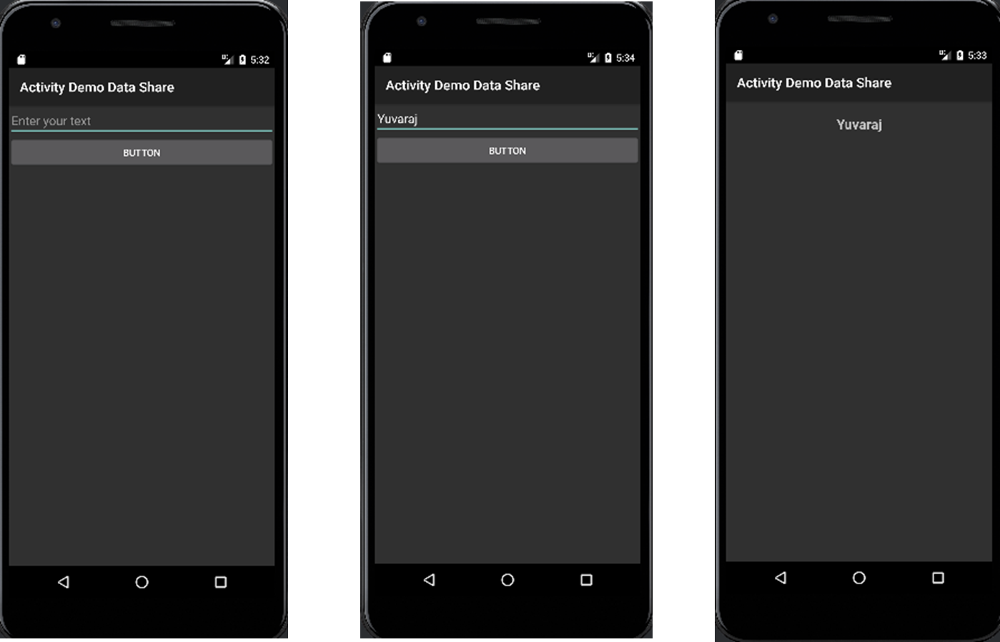

# Lab Assignment \#1 – Developing Android applications that include multiple activities and fragments.

Purpose: The purpose of this lab assignment is to:

- Use Android Studio IDE.

- Use Intents in Android apps for activities.

## Exercise 1

In this exercise, you will build a simple Android application using
Android Studio as shown in the First figure. This displays your Main
Activity labeled as Activity Demo Data Share with Edit Text and Button
control. Change the label as **Assignment 1**. Edit Text’s hint should
be set to **Enter your name**. Also change the Button’s text to **Click
to Send**

During the execution of your app, it should display the main activity
and you should enter your Name in the Edit Text control. (Second
figure).

Button Click operation will send your name to the Second activity and
displayed in a Text View (Third figure).

**<u>Note:</u> Enter your Name in first activity and it should be
displayed in the second activity when you press the button.**
